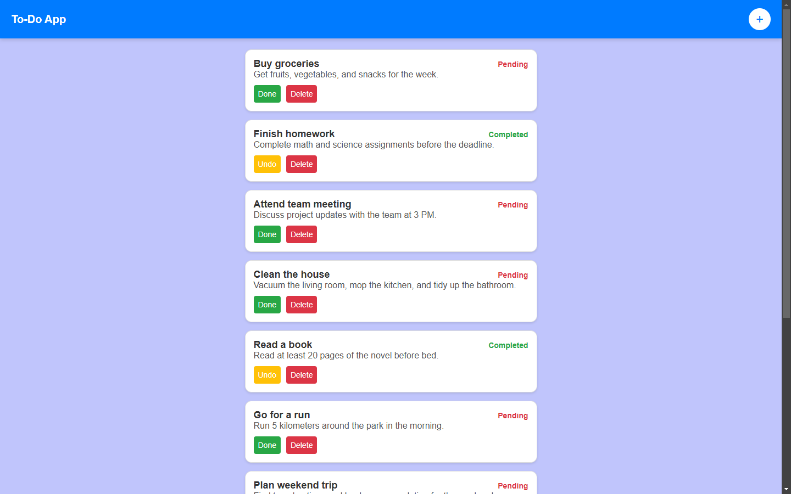

# Todo App (TypeScript) ✨

This is a simple Todo app built with TypeScript to get familiar with the language. 🚀

## Features 🔧

- Add, delete, and mark tasks as complete ✅
- View a list of tasks with their statuses 📋

## Technologies Used 💻

- TypeScript 🟨
- HTML & CSS 🎨
- ParcelJS ⚡

## Screenshot 📷

